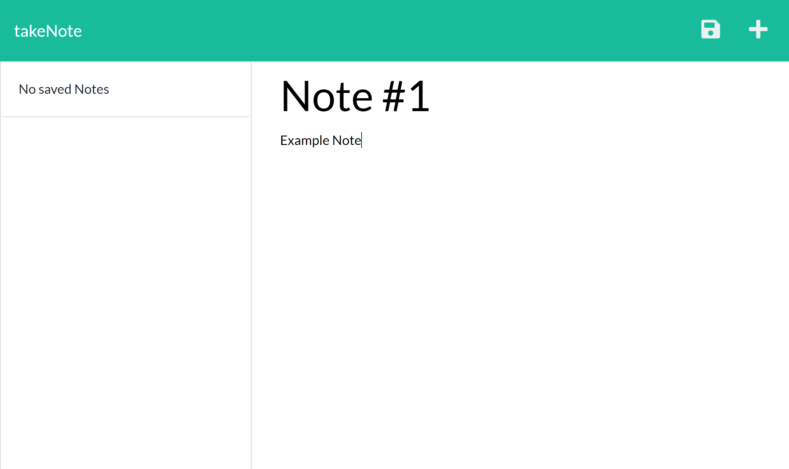

  
  # takeNote
  

  ## Description
  **takeNote** is an application that can be used to write and save notes. This application uses an Express.js back end and will save and retrieve note data from a JSON file.

  My job was to build the back end of the application and then connect to the application's already existing front end. See [Credits](#Credits) for details.

  ## Preview
  

  ## Table of Contents
  * [Installation](#Installation)
  * [Usage](#Usage)
  * [Credits](#Credits)
  * [License](#License)
  * [Contributions](#Contributions)
  * [Questions](#Questions)
  

  ## Installation
  The user may visit the [site deployed on Heroku](https://git.heroku.com/take-note-01.git) to use from their web browser, or they may download a copy of this repository and open from within their own editor.

  ## Usage

  From the landing page in the browsers, users should click `Get Started` to enter takeNote. From the notes page, users can enter a title for the note, then add text for the note. 
  
  

  After adding text, a save icon will appear in the upper right corner. After clicking it, the new note will be saved to the left sidebar. Saved notes will appear with a red trash icon which can be clicked to remove from the sidebar. 
  
  Users can click the note from the sidebar to see it enlarged again in the center pane. *Currently Notes cannot be edited*

  
  
  To add a new note after viewing an old note, click the `+` icon in the upper right. To be redirected to the landing page, click `takeNote` in the upper left corner.

  
  As you can see, deleting a note not only removes it from the sidebar, it also removes it permanently from the database, shown here as `db/db.json` on the right side of the picture.

  Thank you for using!

  ## Credits

  * Application source code is from [miniature-eureka](https://github.com/coding-boot-camp/miniature-eureka).

  * Node.js and Express.js are required to run if you intend to download the application.
  
  * [Article about creating routes for reference](https://expressjs.com/en/guide/routing.html).
  

  ## License
  
  
  ### MIT License

  Copyright 2022 Claire Rosenfrisk

  Permission is hereby granted, free of charge, to any person obtaining a copy of this software and associated documentation files (the "Software"), to deal in the Software without restriction, including without limitation the rights to use, copy, modify, merge, publish, distribute, sublicense, and/or sell copies of the Software, and to permit persons to whom the Software is furnished to do so, subject to the following conditions:
      
  The above copyright notice and this permission notice shall be included in all copies or substantial portions of the Software.
      
  THE SOFTWARE IS PROVIDED "AS IS", WITHOUT WARRANTY OF ANY KIND, EXPRESS OR IMPLIED, INCLUDING BUT NOT LIMITED TO THE WARRANTIES OF MERCHANTABILITY, FITNESS FOR A PARTICULAR PURPOSE AND NONINFRINGEMENT. IN NO EVENT SHALL THE AUTHORS OR COPYRIGHT HOLDERS BE LIABLE FOR ANY CLAIM, DAMAGES OR OTHER LIABILITY, WHETHER IN AN ACTION OF CONTRACT, TORT OR OTHERWISE, ARISING FROM, OUT OF OR IN CONNECTION WITH THE SOFTWARE OR THE USE OR OTHER DEALINGS IN THE SOFTWARE.
  

  ## Contributions
  If you would like to make a contribution or suggestion, please contact me at the email address listed below or send me a DM on GitHub.

  ## Questions
  If you have any questions about this project, please contact me directly at claire.rosenfrisk@gmail.com. You can view more of my work on 
   [My GitHub Profile](https://github.com/crosenfrisk)
